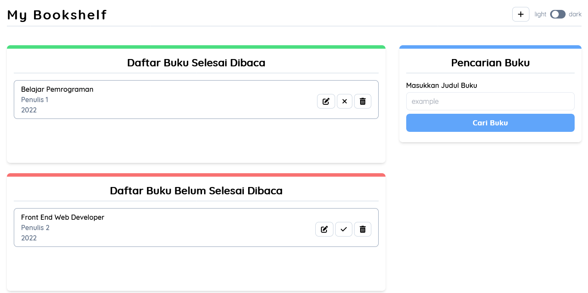
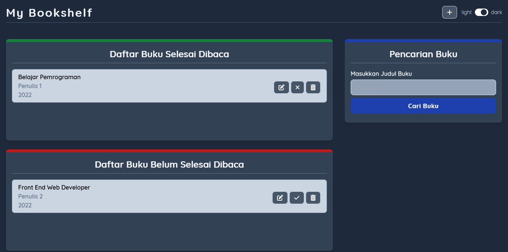

# My Bookshelf App by Muhammad Naufal Farras

Halo semuanya, selamat datang di repository dari project saya pembuatan website penyimpanan buku menggunakan local storage sebagai penyimpanan datanya. Project ini dibuat untuk memenuhi tugas submission dari Dicoding Indonesia untuk kelas Belajar Membuat Front-End Web untuk Pemula. Project ini sepenuhnya dibuat dengan bantuan framework [TailwindCSS](https://tailwindcss.com).

Project ini dibuat tentu masih ada kekurangannya, untuk itu saya memohon maaf apabila masih terdapat bug dan kalian bisa memberikan saya masukan dan saran terkait project yang saya buat ini, Terima Kasih.

## Screenshot

Terdapat 2 mode tampilan pada project ini, yaitu mode terang (light) dan mode gelap (dark). Berikut merupakan screenshot dari kedua tampilan tersebut.

### Mode Terang (Light)

### Mode Gelap (Dark)

## Page Links

Untuk melihat langsung hasil websitenya bisa langsung saja [Klik Disini](https://naufalf25.github.io/my-bookshelf/)

## Tentang Saya

- Instagram - [@naufal_railfans25](https://www.instagram.com/naufal_railfans25/)
- Linkedin - [Muhammad-Naufal-Farras](https://www.linkedin.com/in/muhammad-naufal-farras-2605a2200/)
